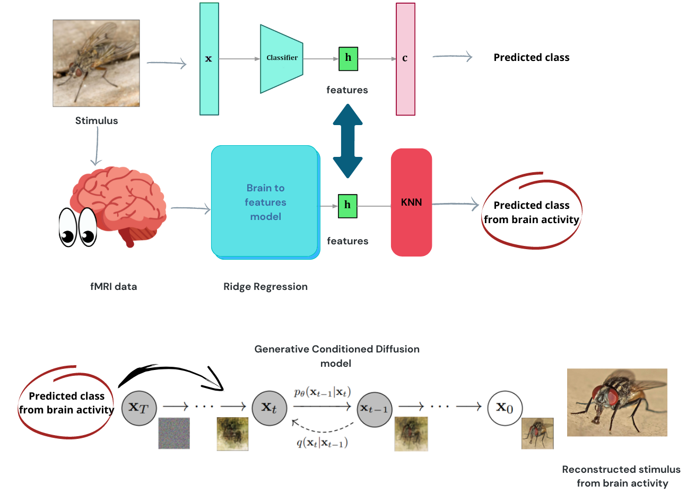
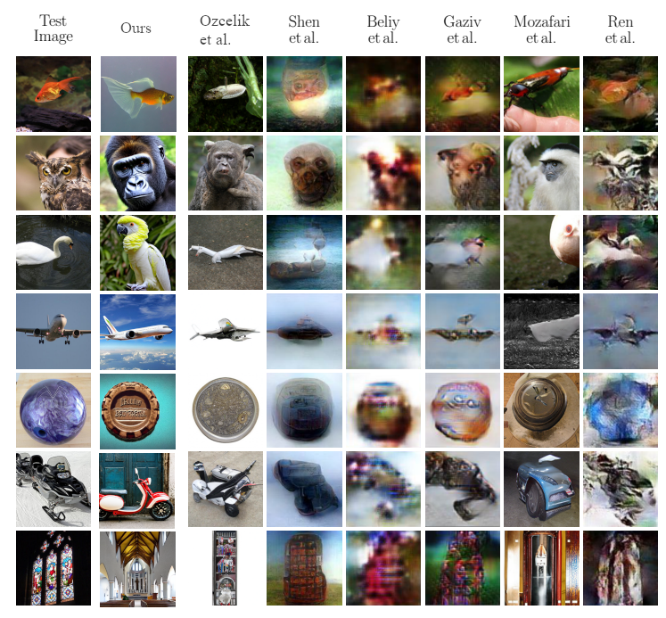
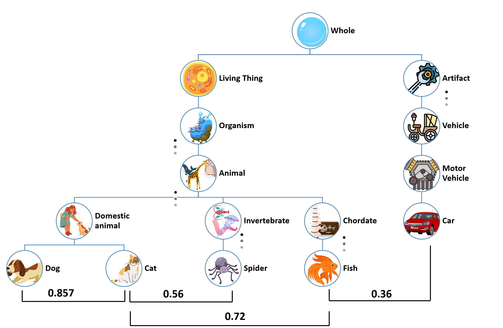
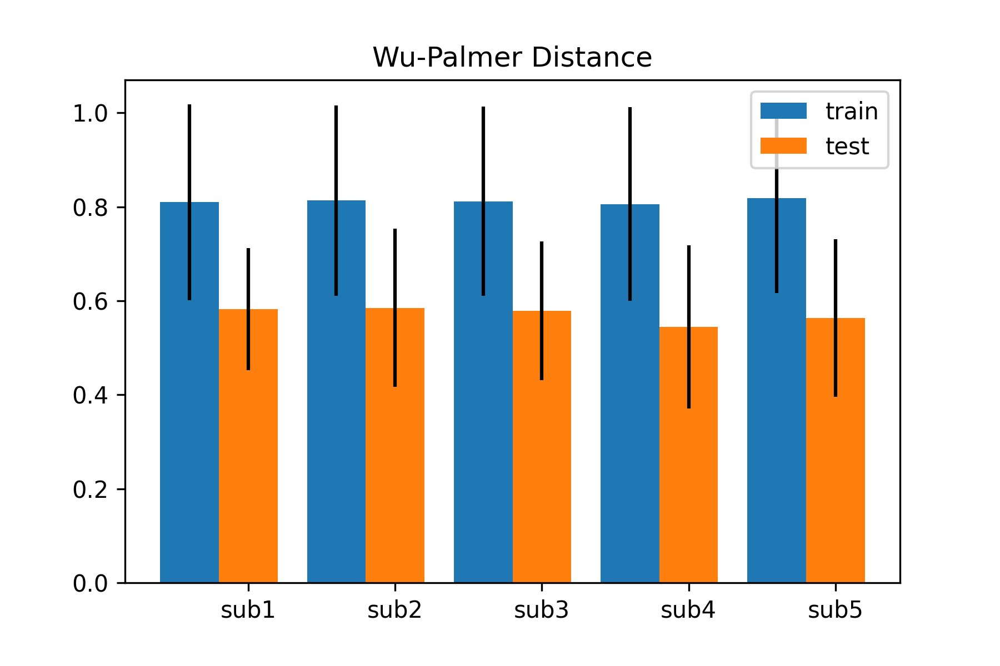
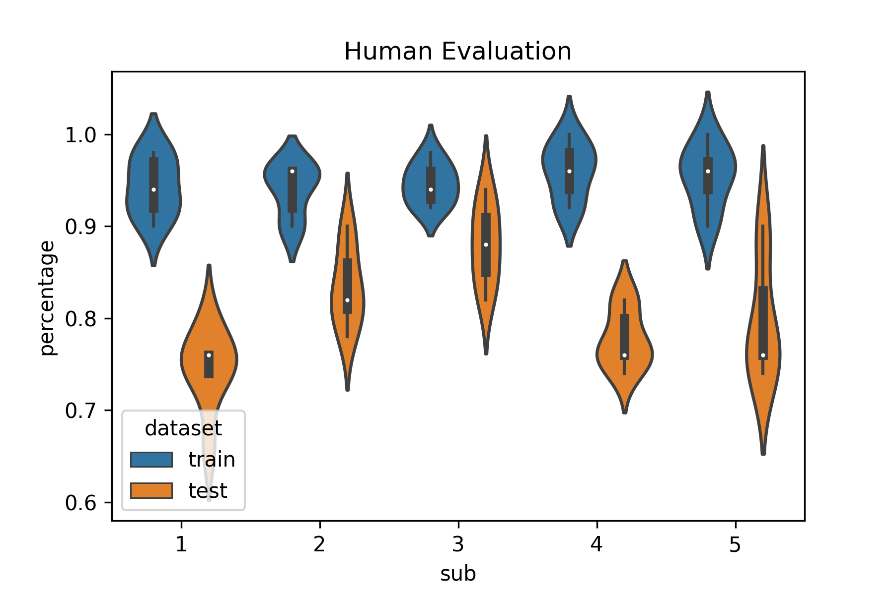

# semantic-brain-decoding

This repository contains the code to support the "Semantic Brain Decoding: from fMRI to conceptually similar image reconstruction of visual stimuli" paper (https://arxiv.org/abs/2212.06726).

In this work, the idea is that the brain process images extracting relevant information in form of features which are similar to the ones extracted by the latent space (last layer before classification) of a CNN. Those "Semantic" features lives in a space (fMRI measurements) that could be homeomorphic to the latent space of the CNN.
We exploited a linear model to estimate the features from brain activity and a kNN to mimic a bottom-up and top-down perception process in the visual cortex and use the classification labels to condition a latent diffusion model to generate images with similar concepts and contents to the target ones used as stimuli during the fMRI experiment, starting from this neurophysiological data.

To reproduce the results, you will need to:

1) Download the processed original fMRI dataset from https://figshare.com/articles/dataset/Generic_Object_Decoding/7387130 and put the downloaded fMRI files in the "data/fMRI/GOD" folder 
2) Download the image stimuli used in the fMRI experiment compiling the form https://forms.gle/ujvA34948Xg49jdn9. After download, training and test images should go under the "data/fMRI/imagenet/images" folder, respectively in the training and test subfolders. In the parent (images) folder place the .csv files.
3) Download the ImageNet latent space features from https://drive.google.com/drive/folders/1wHN1QZkwjan1jp6wDrezWNcCm8kVqOeJ?usp=share_link    
3) Train the models using the train_models.ipynb notebook or download our pretrained models from https://drive.google.com/drive/folders/1UX84IB-l1I_mvhxeDiLgVeVfs1SrjuzX?usp=share_link.

5) Finally, use the semantic_brain_decoding.ipynb notebook to predict labels from brain activity and generate semantic reconstructions.

Below, you can see the comparison between our reconstructions and related work over the same dataset.

To add some quantitative measurements to our work, we measured the Wu-Palmer distance over predicted and real classes to measure semantic similarity. Given the complexity of the theme, we also included a human evaluation of generated images asking to human observer to choose between model generated images and random ones which one is closer to the target images.

If you liked this work, feel free to cite us using 

@misc{https://doi.org/10.48550/arxiv.2212.06726,
  doi = {10.48550/ARXIV.2212.06726},
  
  url = {https://arxiv.org/abs/2212.06726},
  
  author = {Ferrante, Matteo and Boccato, Tommaso and Toschi, Nicola},
  
  keywords = {Computer Vision and Pattern Recognition (cs.CV), Neurons and Cognition (q-bio.NC), FOS: Computer and information sciences, FOS: Computer and information sciences, FOS: Biological sciences, FOS: Biological sciences},
  
  title = {Semantic Brain Decoding: from fMRI to conceptually similar image reconstruction of visual stimuli},
  
  publisher = {arXiv},
  
  year = {2022},
  
  copyright = {Creative Commons Attribution 4.0 International}
}
